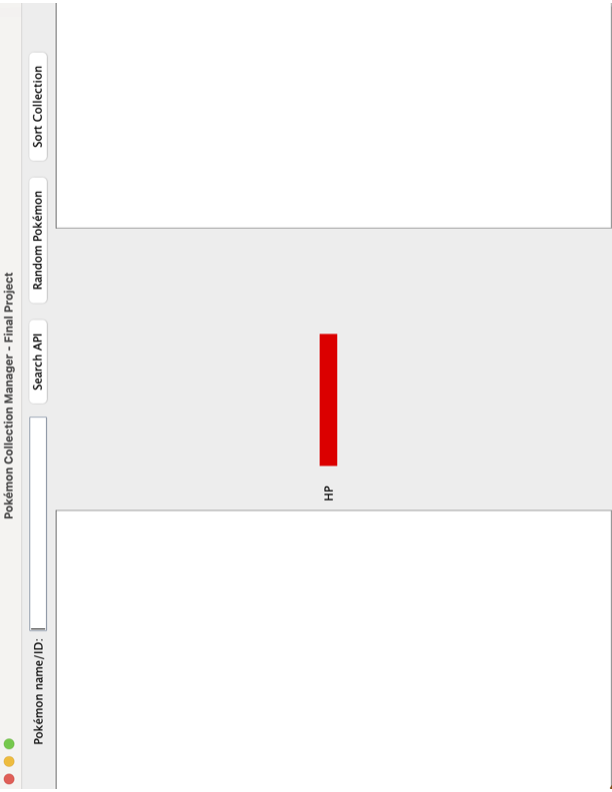
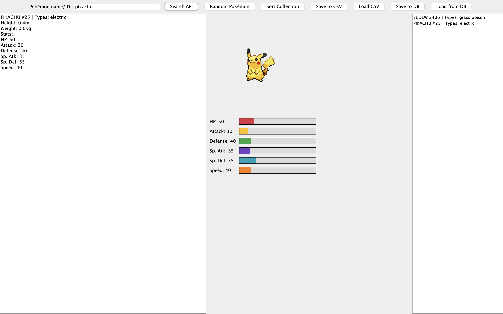
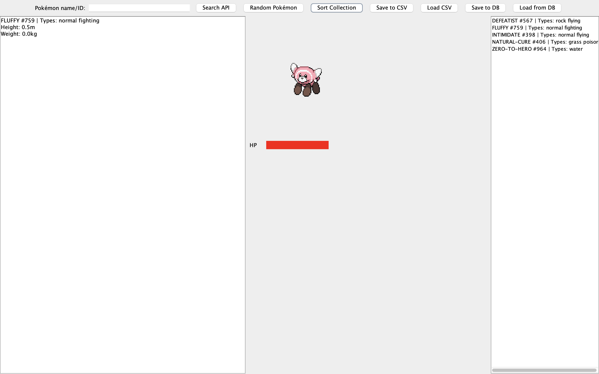

# IDS401 — Pokémon Manager

Simple Java Swing demo project for managing a small Pokémon collection. It demonstrates core Java concepts inlcuding object-oriented programming, GUI development, API integration, file I/O, and classic sorting/searching algorithms.

Contents:
- `pokemonmanager.java` — main source file

## Features
- **Search by name or ID** - fetch live Pokémon data from the [PokéAPI](https://pokeapi.co/)
- **Random Pokémon** - generates a random ID (1-1025) and fetched that Pokémon
- **Sprite display** — renders the official Pokémon front sprite using Java2D graphics
- **Stat bar visualization** — draws HP and stat bars directly on a custom graphics panel
- **Sort collection** — sorts your saved Pokémon alphabetically using bubble sort
- **Binary search** — search your sorted collection efficiently by name
- **Save/Load CSV** — persist your collection to a local `pokemon_collection.csv` file
- **Save/Load Database** — store and retrieve your collection from a MySQL database via JDBC

## Screenshots

**Opening screen:**

*The main window on launch — enter a Pokémon name or ID to search, or hit Random Pokémon.*

**Pokémon search result:**

*Search result for Budew (#406) showing its sprite, types, ability, height, weight, and HP bar.*


**Sort Collection view:**

*The Sort Collection view lists all saved Pokémon by ability name, ID, and types.*


GitHub Pages:
- A lightweight site is published from the `gh-pages` branch: https://TUTULEMAN.github.io/ids401/

How to run locally:
1. Compile:

```powershell
javac pokemonmanager.java
```

2. Run:

```powershell
java PokemonManager
```

Notes:
- This project is a course demo; database credentials and API usage are placeholders.
- Files added for Pages live in the repository and are safe for public browsing.

Updates (4/28/26):
- Made the health bar dynamic so it scales based on each Pokemon's real stats.
- Added more dynamic stat bars at the bottom (Attack, Defense, Sp. Atk, Sp. Def, and Speed).
- Fixed the Excel/CSV export-import behavior so it is functional and no longer a placeholder.
